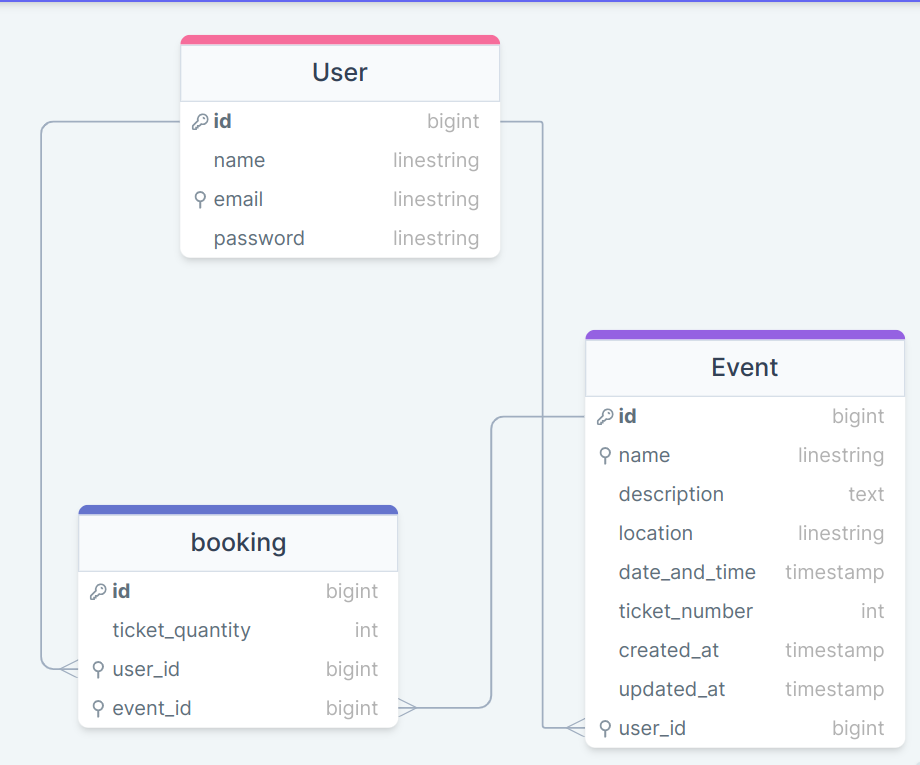

# Event Ticket Booking System

> The Event Ticket Booking System is a Ruby on Rails application designed to facilitate the booking of tickets for various events. The system allows users to register, log in, and book tickets for events. Users can create events with details such as name, description, location, date and time, and total number of tickets available. This app is made these models:

  - User Model
  - Event model
  - Booking model
  
### ERD PG

### Features

- User Registration and Authentication: Users can register, log in, and log out securely.
- Event Creation: Users can create events with details such as name, description, location, date and time, and total number of tickets available.
- Ticket Booking: Users can book tickets for events, with concurrency handling to prevent overbooking.
- Viewing Events: Users can view the list of events, including events they have created and tickets they have booked.
- Display the name of the event while booking instead of the ID for security reasons.

### Concurrency Handling
The application uses optimistic locking to handle situations where multiple users are trying to book tickets for the same event at the same time, ensuring data consistency and preventing overbooking.

### Performance Optimization
Caching mechanisms are implemented using Rails' built-in caching to improve the performance of the application, enhancing the user experience by reducing database queries and speeding up page loads.

### Loom Video
 [Video](https://www.loom.com/share/d498d7b113f54ceea81c718d43425c3f?sid=cb04c1d2-9467-4469-b75c-301d9da02e8e)
## Built With

- Rails
- Ruby 
- Postgresql
- Devise
- Rails built-in caching
- Sidekiq
- Frienldy ID
- taiTailwind
- rubocop
- CD/CI
- Rspec

## Getting Started

Here are the steps to follow in order to get this project on your local computer.

### Prerequisites

`rails v7.0.2 +`

`ruby v3.1.2 +`

### Setup

clone this repo by typing `git clone https://github.com/vic778/Event-ticket-booking`

### Install

install the dependencies by typing `bundle install`

### Usage

start the local server by running `bin/dev`

## Author

👤 **Victor Barh**

- GitHub: [@Vvic778](https://github.com/vic778)
- Twitter: [@victoirBarh](https://twitter.com/)
- LinkedIn: [LinkedIn](https://linkedin.com/in/victoir-barh)

## 🤝 Contributing

Contributions, issues and feature requests are welcome!

Feel free to check the [issues page](issues/).

## Show your support

Give a ⭐️ if you like this project!

## Acknowledgments